# CHƯƠNG 2: PHÂN TÍCH VÀ THIẾT KẾ HỆ THỐNG (UML)

Quá trình phân tích và thiết kế hệ thống là bước bản lề, quyết định sự thành bại của một kiến trúc phần mềm Enterprise. Trong chương này, thay vì chỉ mô tả bề nổi, chúng ta sẽ đi sâu vào việc giải phẫu các luồng tương tác thông qua Ngôn ngữ Mô hình hóa Thống nhất (UML). Tất cả các sơ đồ đều được thiết kế sát với tư duy phân tách không gian làm việc (Multi-workspace) và Kiến trúc Sạch (Clean Architecture).

## 2.1. Sơ đồ Ca sử dụng (Use Case Diagram)

Phân tích Ca sử dụng không chỉ đơn thuần là liệt kê chức năng, mà là việc phân định rõ ranh giới quyền hạn (Authorization Boundaries) của từng nhóm đối tượng, đảm bảo nguyên tắc đặc quyền tối thiểu (Principle of Least Privilege).

Trên thực tế, hệ thống giám sát API là một loại phần mềm có đặc thù rất khác với các hệ CRUD thông thường. Phần "người dùng nhìn thấy" chỉ chiếm một nửa bức tranh. Một nửa còn lại là những luồng nền tự vận hành như Scheduler, cơ chế phân tích lịch sử, phát hiện sự cố, và điều phối cảnh báo. Vì vậy, khi xây dựng Use Case Diagram cho đề tài này, tác giả không chỉ biểu diễn các ca sử dụng tương tác trực tiếp với người dùng, mà còn phải biểu diễn các ca sử dụng hệ thống (System Use Cases) để làm nổi bật yếu tố tự động hóa, vốn là giá trị cốt lõi của nền tảng.

Một điểm quan trọng khác là mọi Use Case trong hệ thống đều phải được nhìn dưới lăng kính đa không gian làm việc (Multi-workspace). Nghĩa là cùng một chức năng "Xem Dashboard" nhưng Dashboard của Workspace A và Dashboard của Workspace B là hai tập dữ liệu hoàn toàn khác nhau. Từ góc độ phân tích hệ thống, đây không còn là một chi tiết triển khai đơn thuần, mà là một ràng buộc kiến trúc tác động tới toàn bộ ca sử dụng, cách định nghĩa Actor, luồng dữ liệu, và cả cơ chế bảo vệ tài nguyên.

### 2.1.1. Sơ đồ Use Case tổng quát

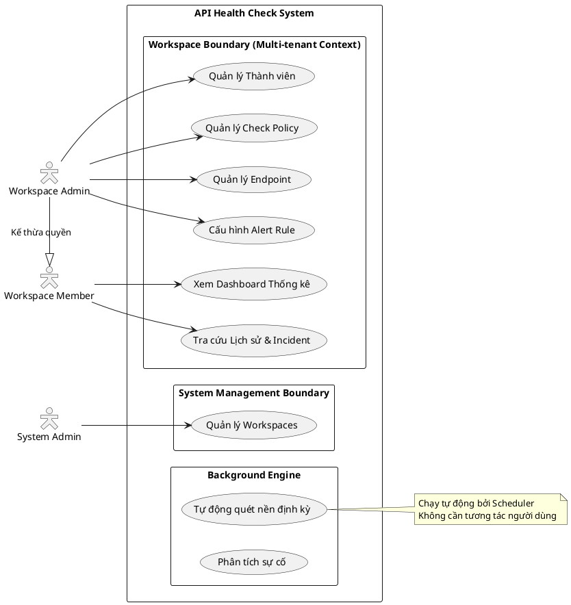

**Biện luận kiến trúc:** Sơ đồ trên thể hiện rõ hai phân vùng an ninh lõi. `System Management Boundary` chỉ dành cho đặc quyền hệ thống, trong khi `Workspace Boundary` là không gian riêng tư của từng đội nhóm. Sự phân tách này là bắt buộc trong môi trường SaaS (Software as a Service) nhằm cách ly rủi ro lộ lọt dữ liệu (Data Leakage) giữa các tenant.

### 2.1.2. Đặc tả chi tiết các Use Case chính

Để phục vụ công tác cài đặt (Implementation), các Use Case phức tạp nhất được đặc tả chi tiết dưới dạng bảng chuẩn Công nghệ Phần mềm (Software Engineering Standard).

**Bảng 2.1. Đặc tả Use Case: Cấu hình Endpoint**

| Thuộc tính | Mô tả |
| :--- | :--- |
| **Mã/Tên UC** | UC-03: Cấu hình Endpoint |
| **Tác nhân** | Workspace Admin |
| **Tiền điều kiện** | User đã xác thực thành công (có JWT) hợp lệ. User là Admin của Workspace hiện hành (Header `X-Workspace-Id` hợp lệ). |
| **Luồng chính** | 1. Admin truy cập giao diện Quản lý Endpoint. 2. Hệ thống tải danh sách các Policy hiện có trong Workspace. 3. Admin điền thông tin: Tên, URL, Giao thức (HTTP/TCP), Tags, và chọn 1 Policy áp dụng. 4. Admin gửi yêu cầu lưu. 5. Hệ thống xác thực quyền hạn và tính hợp lệ của Payload. 6. Hệ thống ánh xạ (Map) dữ liệu vào Domain Entity, gán `workspace_id` và lưu xuống Cơ sở dữ liệu. 7. Trả về thông báo thành công và làm mới danh sách. |
| **Luồng ngoại lệ** | - **Exception 1 (Lỗi phân quyền):** Nếu User truyền `X-Workspace-Id` của một dự án khác, hệ thống chặn ngay tại tầng Security Filter và trả về `403 Forbidden`. - **Exception 2 (Lỗi Policy):** Nếu Policy được chọn không tồn tại hoặc không thuộc cùng Workspace, hệ thống từ chối lưu và ném `BusinessException`. |

**Bảng 2.2. Đặc tả Use Case: Tự động quét nền (Hệ thống)**

| Thuộc tính | Mô tả |
| :--- | :--- |
| **Mã/Tên UC** | UC-SYS-01: Tự động quét nền (Health Check Engine) |
| **Tác nhân** | System Scheduler (Tác nhân hệ thống) |
| **Tiền điều kiện** | Máy chủ (Backend) đang hoạt động. Cơ sở dữ liệu kết nối ổn định. |
| **Luồng chính** | 1. Bộ lập lịch (Cron Job) thức dậy theo chu kỳ cấu hình toàn cục (VD: mỗi 60 giây). 2. Engine truy vấn toàn bộ các Endpoints có trạng thái `ACTIVE` trên tất cả các Workspaces. 3. Với mỗi Endpoint, Engine đọc cấu hình Policy tương ứng. 4. Lựa chọn thuật toán quét (Strategy) tương ứng với giao thức (HTTP/TCP). 5. Thực thi gửi Request/Mở Socket tới máy chủ đích. 6. Đo lường thời gian phản hồi (Latency) và phân tích Body/Status Code. 7. Lưu trữ `HealthCheckResult` xuống Database. 8. Phát hành sự kiện Domain (Event) để kích hoạt luồng Phân tích sự cố (Incident Analysis). |
| **Luồng ngoại lệ** | - **Exception 1 (Lỗi Time-out):** Nếu dịch vụ đích không phản hồi sau khoảng thời gian `timeout_millis` của Policy, hệ thống lập tức chấm dứt thread kết nối, ghi nhận kết quả là `DOWN` với lỗi `Connection Timeout`. - **Exception 2 (Lỗi hạ tầng):** CSDL bị nghẽn (Connection Pool Exhausted), Scheduler sẽ ghi Log khẩn cấp và bỏ qua lượt quét hiện tại để tránh gây sụp đổ hệ thống (OOM). |

**Bảng 2.3. Đặc tả Use Case: Xem Dashboard giám sát**

| Thuộc tính | Mô tả |
| :--- | :--- |
| **Mã/Tên UC** | UC-07: Xem Dashboard giám sát |
| **Tác nhân** | Workspace Member, Workspace Admin |
| **Tiền điều kiện** | Người dùng đã đăng nhập thành công. Người dùng thuộc Workspace đang chọn. |
| **Luồng chính** | 1. Người dùng truy cập màn hình Dashboard. 2. Frontend gửi `X-Workspace-Id` lên backend. 3. Hệ thống xác minh người dùng là thành viên hợp lệ của Workspace. 4. Backend tổng hợp số lượng endpoint theo trạng thái `UP`, `DOWN`, `DEGRADED`. 5. Backend lấy danh sách incident đang mở và lịch sử độ trễ của một số endpoint tiêu biểu. 6. Frontend hiển thị stat cards, active incidents board và latency chart. |
| **Luồng ngoại lệ** | - Nếu người dùng chưa chọn Workspace, frontend hiển thị thông báo yêu cầu chọn Workspace. - Nếu `X-Workspace-Id` không hợp lệ hoặc không thuộc về người dùng hiện tại, backend trả về `403 Forbidden`. - Nếu hệ thống chưa có dữ liệu lịch sử, biểu đồ độ trễ hiển thị trạng thái rỗng nhưng không làm hỏng toàn bộ dashboard. |

**Bảng 2.4. Đặc tả Use Case: Xem danh sách và chi tiết Incident**

| Thuộc tính | Mô tả |
| :--- | :--- |
| **Mã/Tên UC** | UC-08: Tra cứu Incident |
| **Tác nhân** | Workspace Member, Workspace Admin |
| **Tiền điều kiện** | Người dùng đã đăng nhập và thuộc Workspace hiện hành. Dữ liệu Incident đã tồn tại trong hệ thống. |
| **Luồng chính** | 1. Người dùng mở màn hình Incidents. 2. Hệ thống tải danh sách incident theo workspace, hỗ trợ lọc theo trạng thái hoặc endpoint. 3. Người dùng chọn một incident cụ thể. 4. Backend trả về thông tin chi tiết: endpoint liên quan, trạng thái, thời gian mở/đóng, severity, failure count, root cause nếu có. 5. Frontend hiển thị chi tiết để phục vụ phân tích hoặc trình bày demo. |
| **Luồng ngoại lệ** | - Nếu incident không thuộc Workspace hiện hành, backend trả `404` hoặc `403` tùy ngữ cảnh kiểm tra quyền. - Nếu bộ lọc không có kết quả, hệ thống trả danh sách rỗng thay vì lỗi. - Nếu endpoint gốc của incident đã bị xóa hoặc dữ liệu thiếu đồng bộ, hệ thống vẫn phải fail-safe và hiển thị thông tin tối thiểu của incident. |

### 2.1.3. Ma trận Actor - Quyền - Dữ liệu

Đối với một hệ thống nhiều tenant, chỉ vẽ actor là chưa đủ. Cần có một ma trận phân tích chỉ ra rõ mỗi actor được thao tác gì, trên dữ liệu nào, và ở mức quyền nào. Ma trận này là cơ sở để hiện thực hóa Spring Security, `@PreAuthorize`, cũng như các ràng buộc `workspace_id` ở tầng Use Case.

| Nhóm chức năng | System Admin | Workspace Admin | Workspace Member |
| :--- | :---: | :---: | :---: |
| Tạo/Xóa Workspace | Có | Không | Không |
| Quản lý thành viên trong Workspace | Không mặc định | Có | Không |
| CRUD Endpoint/Policy/Alert/Contact | Không mặc định | Có | Không |
| Xem Dashboard | Không mặc định | Có | Có |
| Xem danh sách Incident | Không mặc định | Có | Có |
| Nhận cảnh báo vận hành | Tùy cấu hình | Có | Có thể |

**Nhận xét phân tích:** Ma trận trên cho thấy quyền hệ thống (Global Authorization) và quyền theo không gian làm việc (Contextual Authorization) là hai chiều độc lập. Một người có thể giữ vai trò `ADMIN` ở cấp toàn cục nhưng chưa chắc là thành viên của mọi workspace. Quy tắc này đặc biệt quan trọng để tránh nhầm lẫn giữa vai trò quản trị hạ tầng và quyền xem dữ liệu nghiệp vụ của từng đội.

## 2.2. Sơ đồ Hoạt động (Activity Diagram)

### 2.2.1. Luồng chạy định kỳ của động cơ giám sát

Mục tiêu của thiết kế này là phải đảm bảo tính liên tục và không bị chặn (Non-blocking) của luồng công việc. Nếu một Endpoint bị treo, nó không được phép làm đình trệ toàn bộ tiến trình quét của các Endpoint khác.

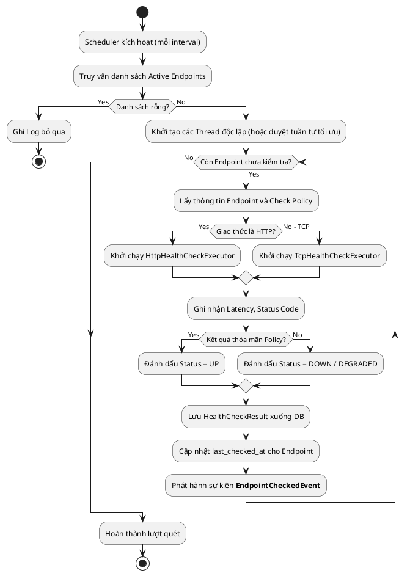

**Phân tích kỹ thuật:** Việc phân tách tác vụ chọn Executor bằng mẫu thiết kế Strategy giúp hệ thống cực kỳ linh hoạt. Thay vì những câu lệnh `if-else` khổng lồ, luồng nghiệp vụ chính chỉ cần biết nó đang gọi một `Executor` trừu tượng.

### 2.2.2. Luồng phát hiện và đóng/mở sự cố (Incident)

Đây là điểm nhấn tạo nên sự thông minh của nền tảng so với các script ping thông thường. Hệ thống ứng dụng khái niệm Cửa sổ trượt (Sliding Window) đối với các kết quả lịch sử để tránh hiện tượng Mệt mỏi Cảnh báo (Alert Fatigue) do lỗi mạng chập chờn.

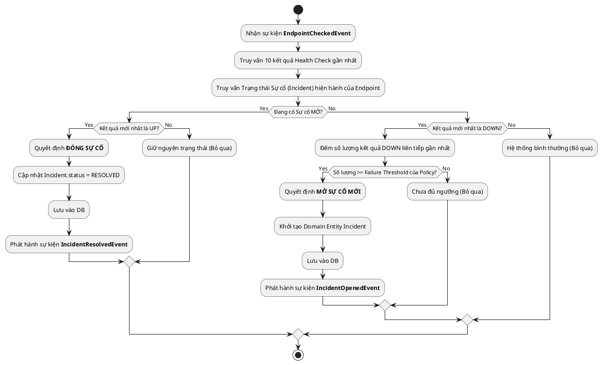

**Phân tích nghiệp vụ:** Sơ đồ hoạt động trên cho thấy hệ thống không hành xử theo tư duy "một lần lỗi là một lần cảnh báo", mà đi theo cơ chế ra quyết định dựa trên ngữ cảnh lịch sử. Đây là khác biệt rất lớn giữa một script ping đơn giản và một hệ thống giám sát phục vụ doanh nghiệp. Nếu không có bước phân tích chuỗi kết quả gần nhất, chỉ một lần timeout ngắn do mạng chập chờn cũng có thể tạo ra cảnh báo giả. Ngược lại, khi đã xuất hiện chuỗi lỗi liên tiếp vượt ngưỡng `failureThreshold`, việc mở incident trở nên có cơ sở và đáng tin cậy hơn.

### 2.2.3. Luồng phát cảnh báo theo sự kiện

Sau khi Incident thay đổi trạng thái, hệ thống cần chuyển thông tin này tới các điểm nhận cảnh báo mà không được làm chậm luồng giám sát lõi. Do đó, một Activity Diagram riêng cho luồng cảnh báo là cần thiết để làm rõ tư duy bất đồng bộ (Asynchronous Processing).

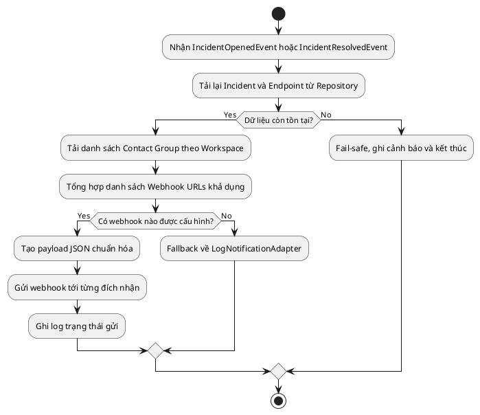

**Ý nghĩa phân tích:** Luồng cảnh báo được cố ý tách rời khỏi luồng monitor chính để tránh Coupling. Nếu webhook lỗi, hệ thống không được phép rollback việc ghi nhận incident vì sự cố nghiệp vụ đã thực sự xảy ra. Quan điểm thiết kế này rất quan trọng khi trình bày trước hội đồng vì nó thể hiện tư duy ưu tiên tính đúng đắn của dữ liệu lõi hơn là tính thành công tức thời của tác vụ ngoại vi.

## 2.3. Sơ đồ Tuần tự (Sequence Diagram)

Các sơ đồ tuần tự dưới đây được lược bỏ các bước xác thực cơ bản nhằm tập trung mô tả dòng chảy nghiệp vụ vĩ mô đi qua các tầng (Layers) của Clean Architecture: từ Controller (Delivery) -> Use Case (Application) -> Domain Logic -> Port & Adapter (Infrastructure).

### 2.3.1. Luồng đăng nhập và xác thực người dùng

Cơ chế xác thực Phi trạng thái (Stateless Authentication) giúp máy chủ loại bỏ gánh nặng lưu trữ Session, đồng thời giải quyết bài toán cấp phép (Authorization) dễ dàng qua chữ ký JWT.

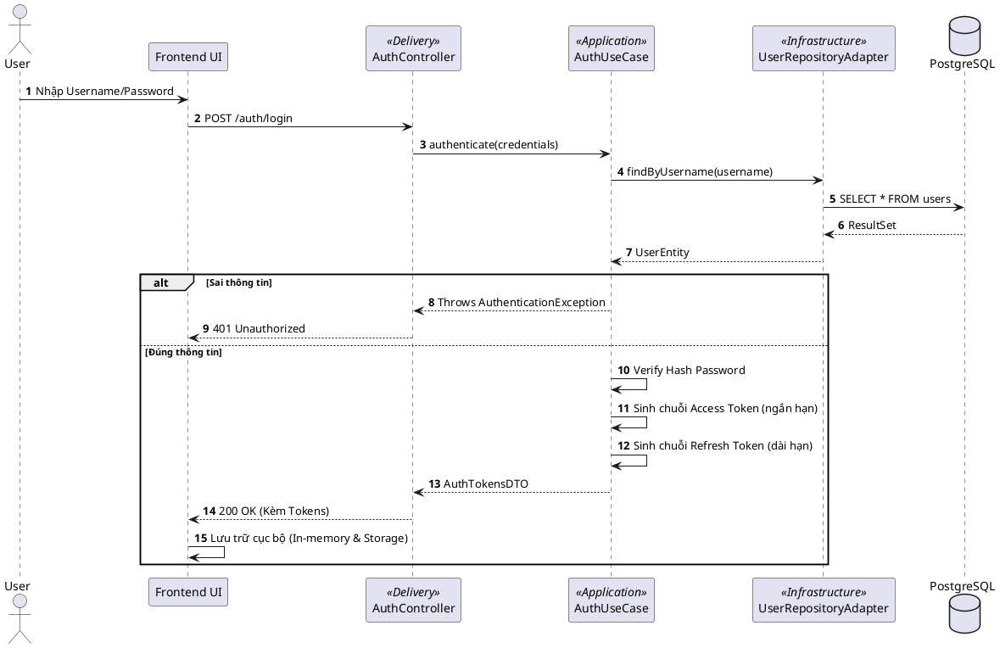

### 2.3.2. Luồng thực thi giám sát và phân tích kết quả

Sơ đồ thể hiện rõ việc Lõi nghiệp vụ (Application + Domain) hoàn toàn bị cô lập với các công nghệ bên ngoài. Các tương tác với DB hay External Network đều thông qua các Ports.

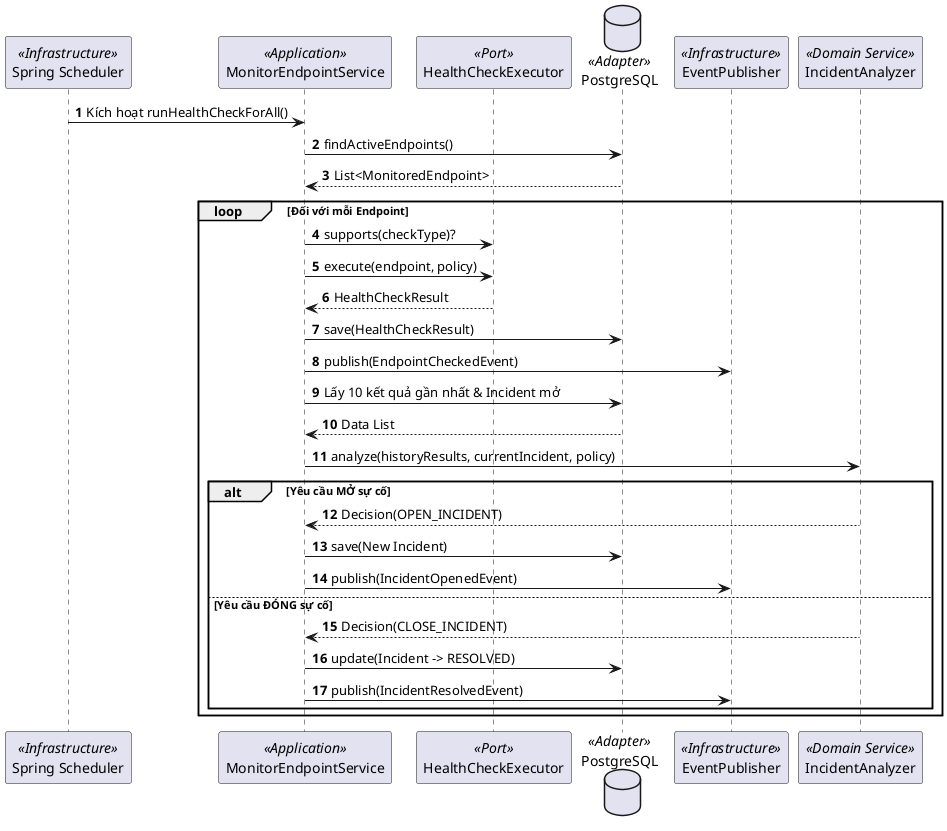

### 2.3.3. Luồng cảnh báo Webhook khi sự cố thay đổi trạng thái

Sơ đồ dưới đây mô tả chính xác cách hệ thống hiện thực hóa tư tưởng Event-driven. Điểm cần nhấn mạnh là `MonitorEndpointService` không gọi trực tiếp ra mạng bên ngoài để gửi cảnh báo. Nó chỉ phát sự kiện, còn listener và adapter sẽ tiếp quản các công việc ở rìa hệ thống.

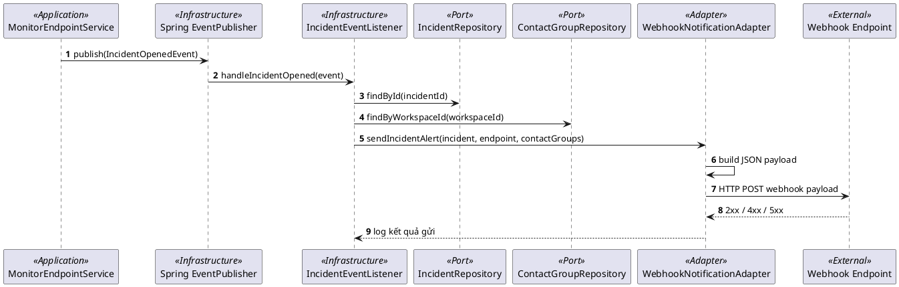

**Giải thích kiến trúc:** Trình tự trên cho thấy hệ thống có ba lớp trách nhiệm rất rõ. Use Case chịu trách nhiệm ra quyết định nghiệp vụ. Event Listener chịu trách nhiệm phản ứng hậu sự kiện. Adapter chịu trách nhiệm giao tiếp với bên ngoài. Việc chia nhỏ như vậy giúp hệ thống kiểm thử dễ hơn, thay thế công nghệ thông báo dễ hơn, và tránh lỗi ngoại vi làm ô nhiễm miền nghiệp vụ.

## 2.4. Sơ đồ Lớp (Class Diagram)

### 2.4.1. Sơ đồ lớp các thực thể nghiệp vụ (Domain Entities)

Biểu diễn khái niệm trừu tượng của dữ liệu (Domain Model) thay vì mô hình Bảng trong Database. `Workspace` đóng vai trò như một Aggregate Root, bao bọc toàn bộ các tài nguyên khác.

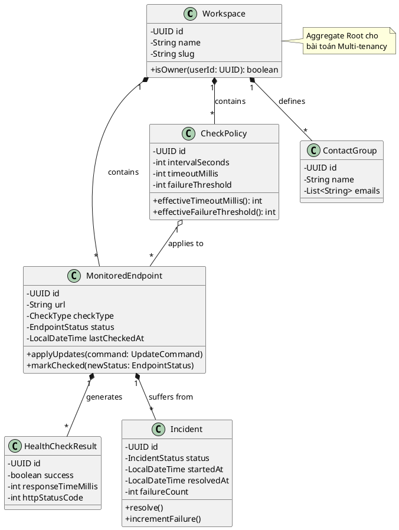

### 2.4.2. Sơ đồ cấu trúc lớp các tầng phần mềm (Ports & Adapters)

Mô hình này chứng minh sự đảo ngược phụ thuộc (Dependency Inversion). Logic nghiệp vụ nằm ở `Use Case` hoàn toàn không biết CSDL của mình là PostgreSQL hay MongoDB, nó chỉ tin tưởng vào các `Port` Interface do chính nó định nghĩa.

```plantuml
@startuml
package "Delivery Layer" #E2F0CB {
  class EndpointController {
    + createEndpoint(dto): Response
  }
}

package "Application Layer (Core)" #C5E0B4 {
  interface ManageEndpointUseCase <<Input Port>> {
    + createEndpoint(command): DTO
  }
  
  class ManageEndpointService {
    - EndpointRepository repo
    + createEndpoint(command): DTO
  }
  
  interface EndpointRepository <<Output Port>> {
    + save(endpoint: MonitoredEndpoint)
    + findById(id: UUID): MonitoredEndpoint
  }
}

package "Infrastructure Layer" #F8CBAD {
  class EndpointRepositoryAdapter {
    - JpaEndpointRepository jpaRepo
    + save(endpoint: MonitoredEndpoint)
    + findById(id: UUID): MonitoredEndpoint
  }
  
  interface JpaEndpointRepository <<Spring Data>> {
    + save(entity)
  }
  
  class MonitoredEndpointJpaEntity {
    - UUID id
    - String tableColumns...
  }
}

EndpointController --> ManageEndpointUseCase : calls
ManageEndpointUseCase <|.. ManageEndpointService : implements
ManageEndpointService --> EndpointRepository : injects

EndpointRepository <|.. EndpointRepositoryAdapter : implements
EndpointRepositoryAdapter --> JpaEndpointRepository : wraps
EndpointRepositoryAdapter --> MonitoredEndpointJpaEntity : maps to
@enduml
```

**Luận điểm kiến trúc:** Sự chia cắt rành mạch trên sơ đồ 2.4.2 là bảo chứng cho độ ổn định của hệ thống. Nếu sau này doanh nghiệp cần chuyển đổi cơ sở dữ liệu sang Oracle, toàn bộ lớp `Application` và `Domain` sẽ giữ nguyên, chi phí tái cơ cấu chỉ gói gọn trong việc viết lại lớp `Adapter` ở tầng Infrastructure. Đây chính là giá trị cốt lõi mang tính học thuật cao của dự án.

## 2.5. Sơ đồ trạng thái của Endpoint và Incident

Đối với phần mềm giám sát, trạng thái không phải là dữ liệu tĩnh mà là dữ liệu động thay đổi liên tục theo thời gian. Vì vậy, việc bổ sung State Model giúp làm rõ các chuyển pha nghiệp vụ là rất cần thiết.

### 2.5.1. Trạng thái của Endpoint

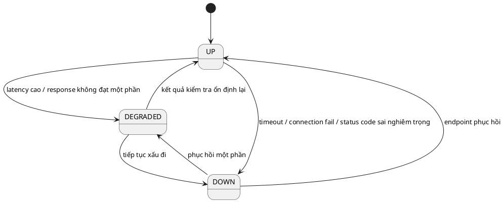

### 2.5.2. Trạng thái của Incident

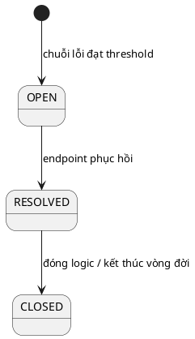

**Bình luận phân tích:** Việc tách biệt trạng thái `Endpoint` và trạng thái `Incident` là một quyết định thiết kế có chủ ý. Endpoint phản ánh sức khỏe tức thời ở lần đo gần nhất, trong khi Incident phản ánh một sự kiện nghiệp vụ kéo dài theo thời gian. Một endpoint có thể dao động giữa `UP` và `DEGRADED`, nhưng không vì thế mà luôn sinh incident. Incident chỉ xuất hiện khi dữ liệu vận hành hội tụ đủ mạnh để kết luận rằng đã có một đợt lỗi đáng quan tâm.

## 2.6. Tổng kết phân tích và thiết kế

Qua các sơ đồ UML và phần đặc tả chi tiết ở trên, có thể rút ra ba kết luận quan trọng về mặt phân tích hệ thống.

Thứ nhất, bài toán của đề tài không chỉ là CRUD cấu hình giám sát, mà là sự kết hợp giữa hệ giao dịch tương tác với người dùng và hệ xử lý nền tự động. Chính vì thế, các sơ đồ Activity và Sequence của luồng Scheduler, Incident và Notification đóng vai trò trọng tâm hơn nhiều so với các sơ đồ nhập liệu thông thường.

Thứ hai, ràng buộc Multi-workspace không phải một tính năng bổ sung, mà là trục xuyên suốt toàn bộ hệ thống. Nó chi phối Actor, Use Case, ma trận quyền hạn, cách định danh dữ liệu, và cả cơ chế phân quyền ở tầng thực thi.

Thứ ba, tư duy phân tích của hệ thống đã được chuẩn bị để phục vụ trực tiếp cho việc cài đặt bằng Clean Architecture. Nghĩa là các khái niệm ở UML như Use Case, Domain Event, Executor, Incident Analyzer, Contact Group không dừng ở mức hình vẽ, mà đã được ánh xạ tương đối trực tiếp vào mã nguồn triển khai thực tế. Đây là điểm mạnh học thuật quan trọng của đồ án.
