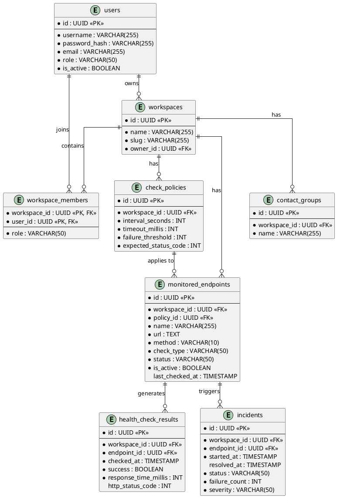

# CHƯƠNG 3: THIẾT KẾ CƠ SỞ DỮ LIỆU (CSDL)

Để đáp ứng khối lượng dữ liệu khổng lồ sinh ra từ các tác vụ giám sát định kỳ (có thể lên tới hàng triệu bản ghi mỗi tháng) và bảo đảm tính toàn vẹn của một nền tảng đa khách hàng (Multi-tenant), hệ thống lựa chọn sử dụng Hệ quản trị Cơ sở dữ liệu Quan hệ (RDBMS) PostgreSQL. Quá trình tiến hóa lược đồ (Schema Evolution) được quản lý tự động thông qua công cụ Flyway, đảm bảo cấu trúc CSDL luôn đồng bộ hóa với phiên bản mã nguồn tại mọi môi trường triển khai.

## 3.1. Sơ đồ quan hệ thực thể (ERD)

Mô hình ERD dưới đây đặc tả chi tiết các thực thể cốt lõi, khóa chính (Primary Key - PK), khóa ngoại (Foreign Key - FK) và các ràng buộc toàn vẹn của hệ thống.

## 3.2. Thiết kế chi tiết các bảng dữ liệu chính

### 3.2.1. Nhóm quản trị: workspaces, workspace_members, users

Đóng vai trò là xương sống cho bài toán định danh và phân quyền, nhóm bảng này cô lập người dùng theo từng không gian dự án.

**Bảng `users` (Người dùng)**
| Tên trường | Kiểu dữ liệu | Ràng buộc | Mô tả nghiệp vụ |
| :--- | :--- | :--- | :--- |
| `id` | UUID | PK | Định danh nội bộ của hệ thống. |
| `username` | VARCHAR(255) | UNIQUE, NOT NULL | Tên đăng nhập dùng cho luồng Authentication. |
| `password_hash` | VARCHAR(255) | NOT NULL | Chuỗi băm mật khẩu bằng thuật toán Bcrypt. Tuyệt đối không lưu bản rõ (plain text). |
| `role` | VARCHAR(50) | NOT NULL | Quyền hệ thống toàn cục (VD: ROLE_ADMIN, ROLE_USER). |
| `is_active` | BOOLEAN | NOT NULL | Trạng thái tài khoản. Hỗ trợ khóa (ban) tạm thời. |

**Bảng `workspaces` (Không gian làm việc)**
| Tên trường | Kiểu dữ liệu | Ràng buộc | Mô tả nghiệp vụ |
| :--- | :--- | :--- | :--- |
| `id` | UUID | PK | Định danh không gian làm việc. Được dùng làm ranh giới bảo mật cho toàn hệ thống. |
| `name` | VARCHAR(255) | NOT NULL | Tên hiển thị của Workspace (VD: Team Backend Alpha). |
| `slug` | VARCHAR(255) | UNIQUE, NOT NULL | Chuỗi định danh thân thiện dùng trên URL. |
| `owner_id` | UUID | FK -> users.id | Người tạo lập và sở hữu gốc của Workspace. |

**Bảng `workspace_members` (Thành viên không gian)**
| Tên trường | Kiểu dữ liệu | Ràng buộc | Mô tả nghiệp vụ |
| :--- | :--- | :--- | :--- |
| `workspace_id` | UUID | PK, FK -> workspaces | Ràng buộc tổ hợp khóa chính. |
| `user_id` | UUID | PK, FK -> users | Ràng buộc tổ hợp khóa chính. Đảm bảo một người không bị tham gia 2 lần. |
| `role` | VARCHAR(50) | NOT NULL | Quyền nội bộ của thành viên (VD: WS_ADMIN, WS_MEMBER). Quyết định quyền thao tác Endpoint. |

### 3.2.2. Nhóm giám sát: monitored_endpoints, check_policies

Bảng chứa dữ liệu cấu hình để động cơ (Engine) dựa vào đó thực thi tác vụ mạng.

**Bảng `check_policies` (Chính sách kiểm tra)**
| Tên trường | Kiểu dữ liệu | Ràng buộc | Mô tả nghiệp vụ |
| :--- | :--- | :--- | :--- |
| `id` | UUID | PK | Định danh chính sách. |
| `workspace_id` | UUID | FK -> workspaces | Buộc Policy phải thuộc về một Workspace, ngăn việc sử dụng chéo trái phép. |
| `interval_seconds` | INT | NOT NULL | Chu kỳ thời gian giữa hai lượt quét liên tiếp. |
| `timeout_millis` | INT | NOT NULL | Ngưỡng thời gian chịu đựng (ms) trước khi cắt kết nối (hủy thread). |
| `failure_threshold` | INT | NOT NULL | Ngưỡng số lần báo lỗi liên tiếp trước khi hệ thống đánh giá là một Sự cố (Incident). |

**Bảng `monitored_endpoints` (Điểm cuối giám sát)**
| Tên trường | Kiểu dữ liệu | Ràng buộc | Mô tả nghiệp vụ |
| :--- | :--- | :--- | :--- |
| `id` | UUID | PK | Định danh mục tiêu cần kiểm tra. |
| `workspace_id` | UUID | FK -> workspaces | Không gian chứa endpoint. Index hỗ trợ truy vấn hiệu năng cao. |
| `policy_id` | UUID | FK -> check_policies | Tham chiếu đến bộ quy tắc cấu hình kiểm tra. |
| `url` | TEXT | NOT NULL | Địa chỉ đích (VD: https://api.example.com/health). |
| `check_type` | VARCHAR(50) | NOT NULL | Giao thức kiểm tra (HTTP, TCP). Xác định việc gọi Executor tương ứng. |
| `status` | VARCHAR(50) | NOT NULL | Trạng thái hiện tại (UP, DOWN, DEGRADED). |
| `is_active` | BOOLEAN | NOT NULL | Cho phép bảo trì (Pause) giám sát mà không cần xóa bản ghi. |

### 3.2.3. Nhóm lịch sử & sự cố: health_check_results, incidents

Bảng dữ liệu lưu trữ lịch sử vận hành, yêu cầu tối ưu Index khắt khe do tốc độ ghi/đọc (Read/Write) cực lớn.

**Bảng `health_check_results` (Lịch sử quét)**
| Tên trường | Kiểu dữ liệu | Ràng buộc | Mô tả nghiệp vụ |
| :--- | :--- | :--- | :--- |
| `id` | UUID | PK | Định danh kết quả quét. |
| `endpoint_id` | UUID | FK -> monitored_endpoints | Ánh xạ về mục tiêu quét. Index gộp `(endpoint_id, checked_at)` là bắt buộc. |
| `checked_at` | TIMESTAMP | NOT NULL | Dấu thời gian khi lượt quét hoàn thành. |
| `success` | BOOLEAN | NOT NULL | Kết quả đánh giá chung: Đạt hay Không đạt. |
| `response_time_millis`| INT | NOT NULL | Độ trễ mạng (Latency) thực tế. Dùng vẽ biểu đồ. |
| `http_status_code` | INT | NULL | Mã HTTP phản hồi (nếu CheckType là HTTP). |

**Bảng `incidents` (Quản lý Sự cố)**
| Tên trường | Kiểu dữ liệu | Ràng buộc | Mô tả nghiệp vụ |
| :--- | :--- | :--- | :--- |
| `id` | UUID | PK | Định danh sự cố nghiệp vụ. |
| `endpoint_id` | UUID | FK -> monitored_endpoints | Nguồn gốc lỗi. |
| `status` | VARCHAR(50) | NOT NULL | Trạng thái sự cố (OPEN, RESOLVED). |
| `started_at` | TIMESTAMP | NOT NULL | Thời điểm chính thức MỞ sự cố (sau khi rớt đạt ngưỡng threshold). |
| `resolved_at` | TIMESTAMP | NULL | Thời điểm endpoint phục hồi. Null nếu đang OPEN. |

## 3.3. Cơ chế phân vùng dữ liệu theo Workspace (workspace_id)

Hệ thống được thiết kế theo kiến trúc **Multi-tenant Shared Database** (Sử dụng chung một Cơ sở dữ liệu và chung một Schema cho mọi khách hàng/đội nhóm). Trong kiến trúc phần mềm doanh nghiệp, cách tiếp cận này tối ưu hóa chi phí hạ tầng (Cost-effective) và giảm thiểu gánh nặng quản trị so với việc tạo mỗi khách hàng một Database riêng biệt. Tuy nhiên, sự chia sẻ tài nguyên vật lý kéo theo một rủi ro cực kỳ nghiêm trọng về an toàn thông tin: Nếu một đoạn mã lập trình bị rò rỉ hoặc thiếu chặt chẽ, người dùng thuộc dự án A hoàn toàn có thể nhìn thấy, thậm chí chỉnh sửa hoặc xóa dữ liệu nhạy cảm (như URL cấu hình hệ thống, lịch sử sập nguồn) của dự án B.

Để phòng thủ chủ động trước rủi ro này, giải pháp cơ bản là áp đặt một ranh giới logic tuyệt đối tại tầng Ứng dụng (Application Layer). Trụ cột của cơ chế này là sự hiện diện bắt buộc của trường `workspace_id` trên gần như mọi bảng dữ liệu nghiệp vụ (`endpoints`, `policies`, `incidents`, `results`). Bất cứ một thao tác Truy vấn (Query) hay Sửa đổi (Mutation) nào từ phía Frontend gửi xuống, bên cạnh việc kiểm tra chữ ký xác thực JWT, hệ thống đều trích xuất `X-Workspace-Id` từ HTTP Header. Tiếp theo, ở tầng Use Case, lập trình viên bị ép buộc phải nối thêm điều kiện `WHERE workspace_id = ?` vào toàn bộ câu lệnh JPA/SQL. Thiết kế này cung cấp một lá chắn vô hình nhưng vững chắc, loại trừ hoàn toàn lỗ hổng bảo mật khét tiếng **Insecure Direct Object Reference (IDOR)**. Dù một đối tượng phá hoại (Attacker) có dò đoán (Brute-force) thành công mã định danh (UUID) của một bảng ghi thuộc Workspace khác, cơ sở dữ liệu cũng sẽ trả về tập rỗng, đảm bảo sự cô lập dữ liệu (Data Isolation) tuyệt đối và tuân thủ chặt chẽ tiêu chuẩn kiểm toán an ninh bảo mật.
