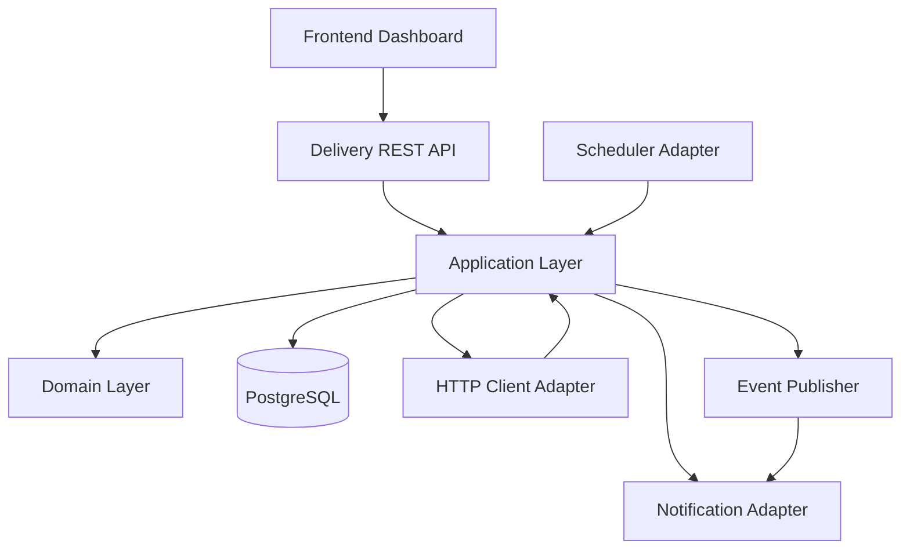

# Component Diagram

## Ghi chú

- `Delivery` chỉ gọi `Application`, không truy cập trực tiếp database.
- `Infrastructure` sẽ chứa triển khai cụ thể cho `Scheduler`, `HTTP client`, `Repository`, `Notification`.
- `Domain` giữ business rule và không phụ thuộc framework.
