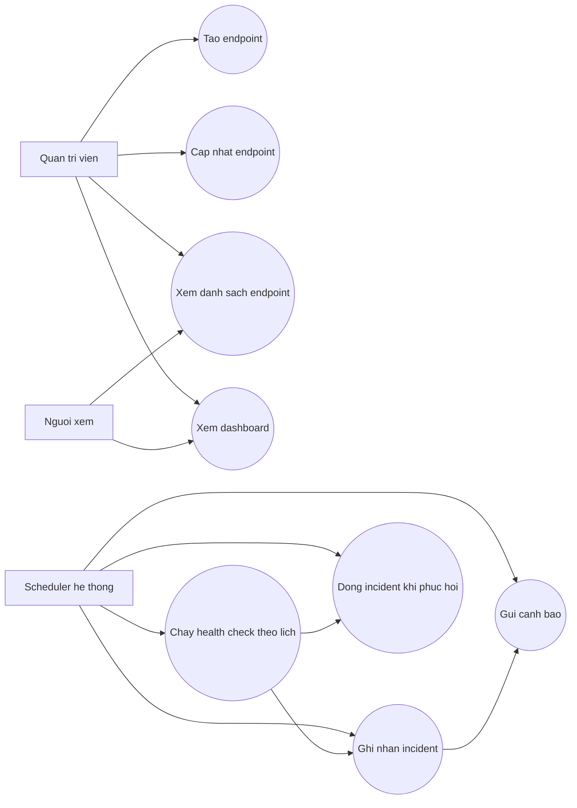

# Use Case Diagram

## Ghi chú

- Phiên bản đầu ưu tiên `HTTP health check`.
- Incident được tạo sau khi lỗi liên tiếp đạt ngưỡng.
- Cảnh báo có thể được gửi khi mở incident hoặc khi phát hiện độ trễ bất thường.
